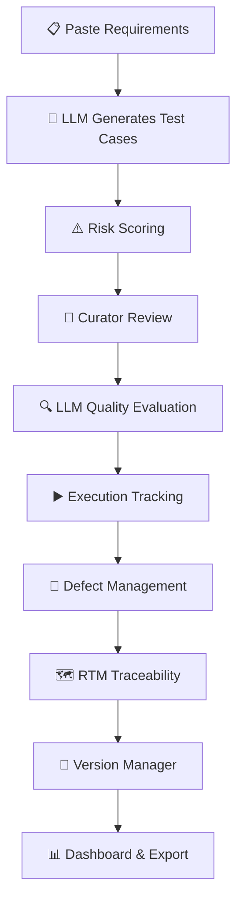

*Estimated read: 6–7 minutes*

---

If you've been following along from [previous article](https://bellatrijuliana.com/articles/docqa-v2-local-llm-and-risk-based-testing-tool) , you've seen this project grow from a script that generated test cases, to a v2 powered by a local LLM. This is the next chapter and it's a bigger one.
 
Meet **Zelqa**. 👋
 
---
 
## How it actually got here
 
After v2 had been running in my daily workflow for a while, I did something I probably should have done earlier: I sat down and mapped out every friction point that was still left.
 
Not just the obvious ones. All of them.
 
What I found was that v2 had solved the *generation* problem really well. Pasting a user story and getting test cases out the other side that part worked. But everything that came *after* generation was still largely manual. Logging execution results, managing defects, tracking when requirements changed and my test cases became stale, producing reports that looked professional enough to share, none of that had a home in the tool.
 
I also went and looked at other tools again. Same exercise as before v1, but this time with more context. Some had features I genuinely envied. But the same walls were still there: pricing, feature limits, workflows built for teams rather than a solo engineer in a fast-moving startup. Nothing quite fit.
 
So I did what felt natural at this point, I mapped what I actually needed, and I built it.
 
---
 
## Why the rename?
 
DocQA was named for what it did. But as the scope expanded into a full lifecycle framework, the name felt too narrow for where this was heading.
 
**Zelqa** isn't an acronym or a description. It's a name for something I want to keep building, a framework that can grow, take on new capabilities, and eventually become something more than a collection of Python scripts. The rename was also a small personal marker: this isn't a patch on top of DocQA anymore. It's a new thing.
 
The long-term hope is that Zelqa becomes a platform, something with a proper interface, a community, tooling that other QA engineers can actually use and benefit from. That's still a ways off. But naming it Zelqa was the first step toward thinking about it that way.
 
---
 
## What Zelqa covers
 
The goal: the **complete QA lifecycle** in a single, self-contained Python project.
 

 
| Step | Module | What it does |
|---|---|---|
| 01 | **Requirement Intake** | Paste raw text from a user story or Jira ticket, no reformatting needed |
| 02 | **Test Case Generation** | LLM generates Positive, Negative, Boundary, and Edge Cases in one go |
| 03 | **Risk Scoring** | Probability × Impact (max 25), with LLM reasoning explaining *why* each scenario is risky |
| 04 | **Curator Review** | Go through cases sorted by risk level, approving or rejecting interactively |
| 05 | **LLM Quality Evaluation** | 5-criteria rubric scores each batch, so you know how much to trust the output |
| 06 | **Execution Tracking** | Log Pass, Fail, Skip, or Blocked results per sprint |
| 07 | **Defect Management** | When a test fails, Zelqa drafts the bug report automatically |
| 08 | **RTM** | Requirements Traceability Matrix, shows what's covered, partial, or missed |
| 09 | **Version Manager** | Flags stale test cases when requirements change mid-sprint |
| 10 | **Dashboard & Export** | Full HTML report + export to Excel, PDF, CSV for Jira, or CSV for TestRail |
 
Requirements in. Professional QA documentation out.
 

  <figure>
    
    <figcaption>From requirements to results,  the full picture in one view.</figcaption>
</figure>

---
 
## The rule that hasn't changed
 
From DocQA v1 all the way to Zelqa, this stays:
 
> **Everything runs 100% locally.** No data leaves your machine. No API keys, no subscriptions, no cloud.
 
Zelqa uses Ollama to run models like `gemma3:1b` or `llama3.2` natively. In a startup environment, where you're working with real product requirements, this isn't optional.
 
---
 
## What's new compared to DocQA v2
 
DocQA v2 was solid at *generating* test cases. Zelqa covers what happens *after*.
 
| Feature | DocQA v2 | Zelqa v1.0 |
|---|---|---|
| Test case generation | ✅ | ✅ |
| Risk scoring (RPN) | ✅ | ✅ |
| Curator review | ✅ | ✅ |
| Execution tracking | ❌ | ✅ |
| Defect management | ❌ | ✅ |
| LLM quality evaluation | ❌ | ✅ |
| Requirements traceability (RTM) | ❌ | ✅ |
| Version & outdated detection | ❌ | ✅ |
| Export (Excel, PDF, CSV) | ❌ | ✅ |
| Dashboard | Basic | Full dark-mode dashboard |
 
 <figure>
    
    <figcaption>Every feature has a risk story. This is where Zelqa tells it.</figcaption>
</figure>

The **version manager** deserves a specific mention. Requirements changing mid-sprint is basically a given in fast-moving teams. Zelqa compares updated requirements against existing test cases, classifies each as valid, needs update, or outdated, and walks through an interactive review. That used to be entirely manual and it was easy to miss things.

 <figure>
    
    <figcaption>Requirements changed. Zelqa already knows which test cases didn't keep up.</figcaption>
</figure>
 
---
 
## The LLM quality evaluator -> making AI output measurable
 
One thing I kept running into with v2: how do you actually know if the generated test cases are good? You can eyeball them, but that scales poorly.
 
Zelqa's evaluator scores each batch on a 5-criteria rubric (1–5 per criterion, max 25):
 
- **Accuracy** : technically correct and matches the requirement
- **Relevance** : targets the right feature and scenario
- **Completeness** : covers happy path, negative, and boundary cases
- **Clarity** : steps and expected results are unambiguous
- **Safety** : considers security and data sensitivity

<figure>
    
    <figcaption>Not just generated, but also its evaluated. Every batch gets a score.</figcaption>
</figure>

Over time, the scores reveal patterns which feature types consistently produce strong output, and which ones need more manual attention. It turns a black-box process into something you can actually reason about and improve.

<figure>
    
    <figcaption>Because 'the AI said so' isn't good enough on its own.</figcaption>
</figure>
 
---
 
## The tech stack
 
| Layer | Tool |
|---|---|
| Core Logic | Python |
| LLM Host | Ollama (`gemma3:1b` or `llama3.2`) |
| Database | SQLite (8 tables) |
| Dashboard | HTML5 (dark mode) |
| Export | Excel via `openpyxl`, PDF via `reportlab` |
 
Single project folder. No Docker, no cloud setup. Python and Ollama, and everything else follows.
 
---
 
## This is v1.0 and that's the point
 
Zelqa v1.0 is a foundation. The framework is modular by design, each script is independent and can be extended without touching everything else.
 
There's more planned. A proper web interface. Smarter requirement parsing. Deeper documentation tooling. And eventually, something that feels less like a personal script and more like a platform that other QA engineers can actually pick up and use.
 
Three years of real QA work went into understanding what this tool needs to be. If any part of it resonates, the local LLM approach, the risk scoring, the version tracking, or just the idea that documentation overhead doesn't have to own your time,  it's open source, and it's yours to take and adapt.
 
That's exactly why it's built this way.
 
---
 
## Try it out
 
Access the repository here → [github.com/bellatrijuliana/zelqa](https://github.com/bellatrijuliana/zelqa)
 
Clone it, run it locally, or just read through the code. And if you find something that could be better -> feedback and contributions are always welcome.
 
---
 
*To every solo QA engineer out there — this one's for you. 💚*